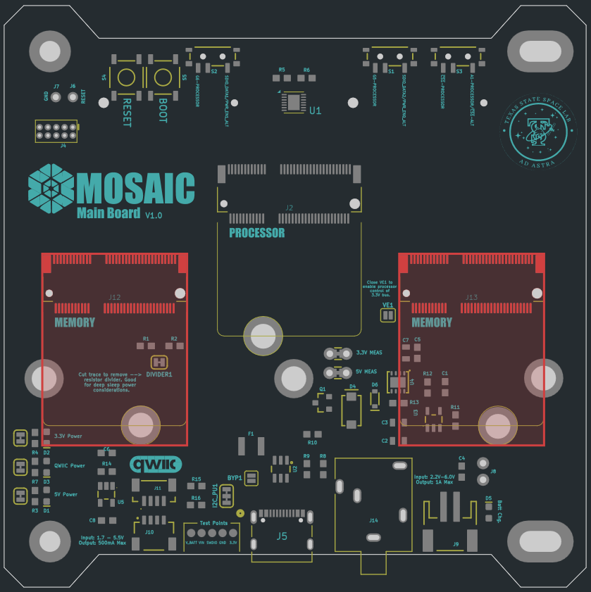

# Overview

MOSAIC’s `Main Board` is the central hub of the mocksat, connecting together all other components. This board contains the entire MOSAIC Command and Data Handling (CDH) subsystem. The command duties are performed by a swappable computer processor at the center of the board. Data storage is fulfilled by equally swappable modules that connect to the board. 

However, MOSAIC’s `Main Board` is much more than the CDH subsystem. Also included are two slots for interchangeable function boards. These boards add functionality to the `Main Board`, like environmental sensors and radio communication.

??? info "Based on MicroMod Main Board - Double"
    MOSAIC's Main Board design is based on the MicroMod Main Board - Double from [Sparkfun electronics](https://www.sparkfun.com/sparkfun-micromod-main-board-double.html).

    All Sparkfun MicroMod processors and function boards are compatable with MOSAIC's Main Board. 

<figure markdown="span">
 
  <figcaption>Figure 1: MOSAIC Main board (a) top with attached processor and memory module, (b) top without attached modules, (c) Bottom with two function boards attached, (d) bottom without attached function boards</figcaption>
</figure>

## Features

### Customizable -

Five [M.2](https://en.wikipedia.org/wiki/M.2) slots on MOSAIC's `Main Board` allow users to to customize their boards with three different kinds of modules:

| Module Type       | Board Location                                                                                  | Number of Slots | Description            |
| :----------- | :------------------------------------------------------------------------------------------- | :-------------: | :--------------------- |
| [Processor](https://www.mosaicsat.org/core_documentation/hardware/main_board/processors/) | Front { width="250" height="250" }  | 1 | Brain of the satellite. |
| [Expandable Memory](https://www.mosaicsat.org/core_documentation/hardware/main_board/memory_modules/) | Front { width="250" height="250" }  | 2 | Expandable memory storage beyond what's included in the processor modules. |
| [Function Boards](https://www.mosaicsat.org/core_documentation/hardware/main_board/function_boards/) | Back { width="250" height="250" }  | 2 | Add functionality to the board like radio transceivers and GPS. |

### Standard -

The following are non-customizable features that are standard on all on MOSAIC `Main Boards`:

| Feature      | Description                          | Datasheet |
| :----------- | :------------------------------------ | :---------------------: |
| USB/Battery Voltage Regulator | Input: 2.2V-6V; Output: 1A max | [AP7361C](https://jlcpcb.com/api/file/downloadByFileSystemAccessId/8560079564241199104) |
| Qwiic Voltage Regulator | Input: 1.7-6V; Output: 500mA max, fixed 3.3V | [XC6503D331MR-G](https://jlcpcb.com/api/file/downloadByFileSystemAccessId/8590196445028003840) |
| Built-in Resettable PTC Fuse | Rated 5V/2A | [ASMD1210](https://jlcpcb.com/api/file/downloadByFileSystemAccessId/8588899520989548544) |
| 2-Pin JST Connector | For connecting LiPo battery | [JST-PH 2-pin SMT](https://www.mouser.com/ProductDetail/485-1769) |
| Single Cell LiPo Charge Circuit | Charges attached single cell LiPo battery from USB power source | [MCP73831](https://jlcpcb.com/api/file/downloadByFileSystemAccessId/8588884548142292992) |
| USB Type C Connector | For data connection with attached processor module and power transfer | [USB Type C Connector](https://jlcpcb.com/api/file/downloadByFileSystemAccessId/8590906928107372544) |
| 2x Qwiic Connectors | For data connection between other MOSAIC boards using the I^2^C protocol | [Qwiic Connector](https://jlcpcb.com/api/file/downloadByFileSystemAccessId/8590907288981364736) |
| SWD 2x5 Header | Serial Wire Debug header used for programming and debugging microcontrollers | N/A |
| Multiplexer for UART1  | For pin management between the two function board slots and the `Main Board` processor | [MAX4932ETD+T](https://jlcpcb.com/api/file/downloadByFileSystemAccessId/8589032502153789440) |
| Boot and Reset Buttons | For programming an attached `Main Board` processor | [Tactile Switch](https://jlcpcb.com/partdetail/11399-4_4_1_7_SurfaceMount/C10852) |
| 3x I/O switches | For pin management between the two function board slots and the `Main Board` processor | [Slide Switch](https://jlcpcb.com/api/file/downloadByFileSystemAccessId/8603117332785491968) |