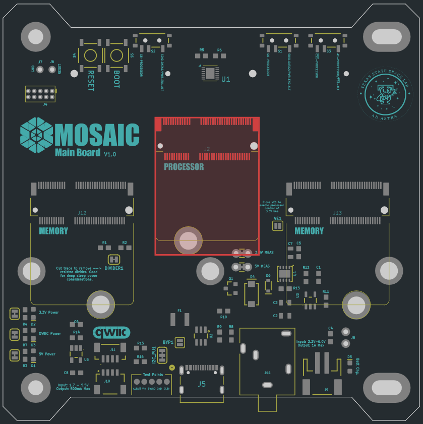
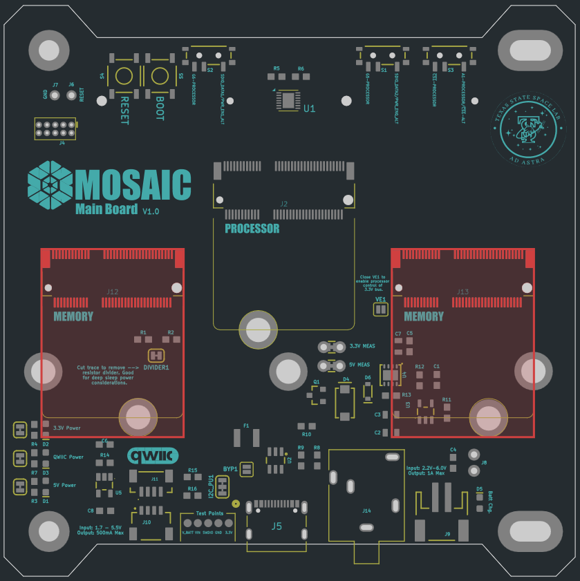
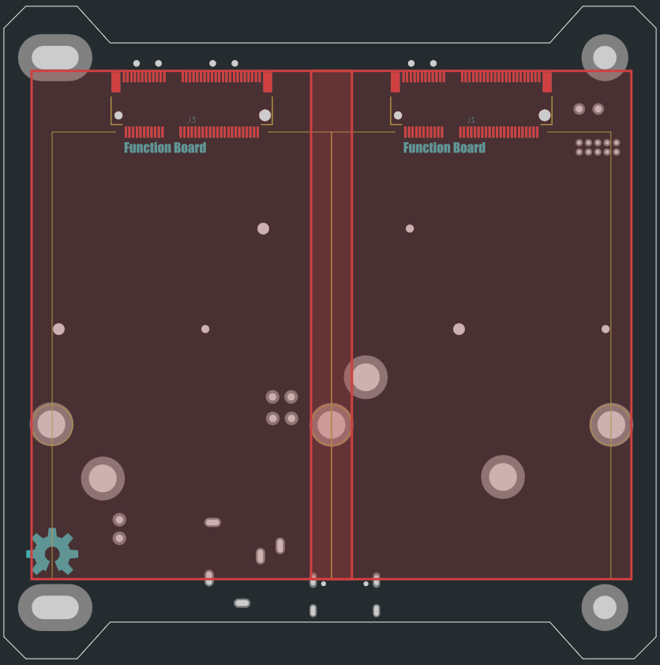

# Overview

MOSAIC’s *Main Board* is the central hub of the mocksat, connecting together all other components. This board contains the entire MOSAIC Command and Data Handling (CDH) subsystem. The command duties are performed by a swappable computer processor at the center of the board. Data storage is fulfilled by equally swappable modules that connect to the board. 

However, MOSAIC’s *Main Board* is much more than the CDH subsystem. Also included are two slots for interchangeable function boards. These boards add functionality to the *Main Board*, like environmental sensors and radio communication.

<figure markdown="span">
 
  <figcaption>Figure 1: MOSAIC Main board (a) top with attached processor and memory module, (b) top without attached modules, (c) Bottom with two function boards attached, (d) bottom without attached function boards</figcaption>
</figure>

## Features

### Customizable:

Five [M.2](https://en.wikipedia.org/wiki/M.2) slots on MOSAIC's Main Board allow users to to customize their boards with three different kinds of modules:

| Method       | Description                                                                                  | Number of Slots | Description            |
| :----------- | :------------------------------------------------------------------------------------------- | :-------------: | :--------------------- |
| [Processor](https://www.mosaicsat.org/core_documentation/hardware/main_board/processors/) | { width="170" height="170" }  | 1 | Brain of the satellite. |
| [Expandable Memory](https://www.mosaicsat.org/core_documentation/hardware/main_board/memory_modules/) | { width="170" height="170" }  | 2 | Slots for expanding memory storage beyond what's included in the processor modules. |
| [Function Boards](https://www.mosaicsat.org/core_documentation/hardware/main_board/function_boards/) | { width="170" height="170" }  | 2 | Slots for adding function boards to the Main Board. These add functionality like radio transceivers and GPS. |