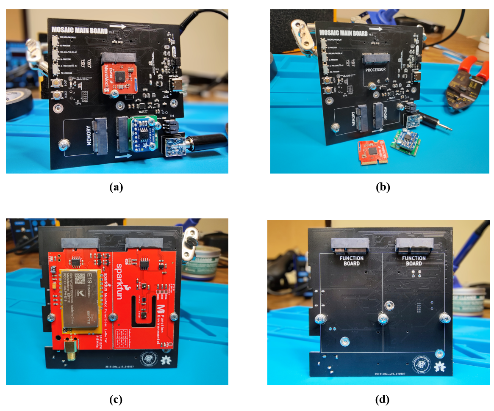

# Overview

MOSAIC’s Main Board is the central hub of the mocksat, connecting together all other components. This board contains the entire MOSAIC Command and Data Handling (CDH) subsystem. The command duties are performed by a swappable computer processor at the center of the board. Data storage is fulfilled by equally swappable modules that connect to the board. 

However, MOSAIC’s Main Board is much more than the CDH subsystem. Also included are two slots for interchangeable function boards. These boards add functionality to the Main Board, like environmental sensors and radio communication.

<figure markdown="span">
 
  <figcaption>MOSAIC Main board (a) top with attached processor and memory module, (b) top without attached modules, (c) Bottom with two function boards attached, (d) bottom without attached function boards</figcaption>
</figure>

## Features