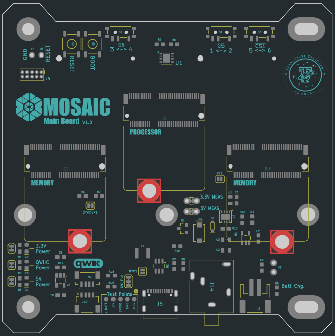
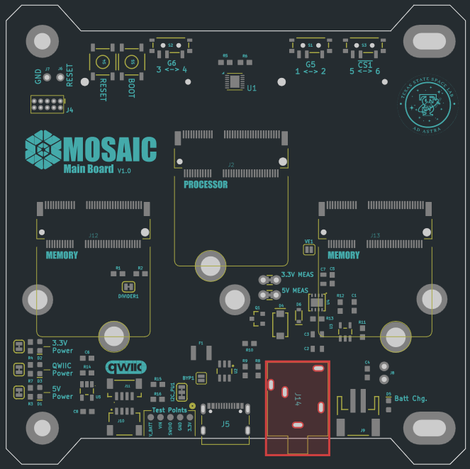
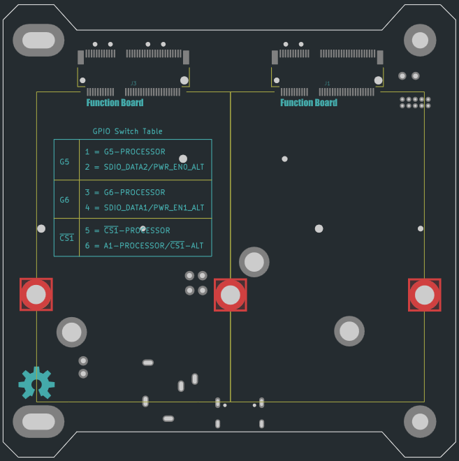
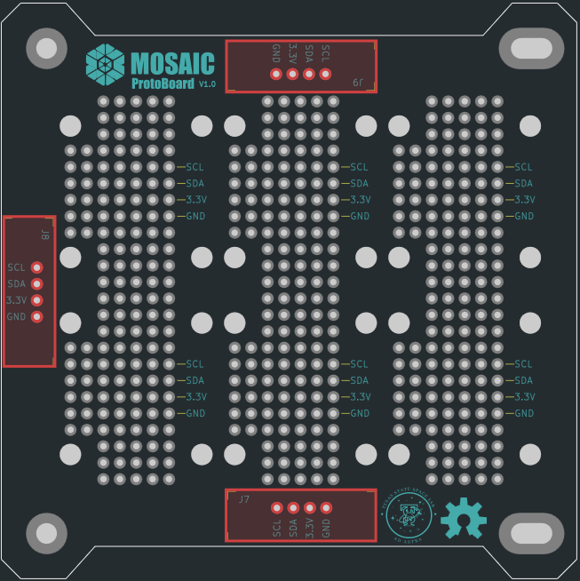

Once your (mostly) assembled boards have arrived from JLCPCB (Step 1), and you've received all necessary components from MOSAIC's BOM (Step 2), you're then ready to finish the assembly of these boards.

There are a few components on MOSAIC's Main Board and ProtoBoard that JLCPCB doesn't assemble in step 1 of this guide. Follow the steps below to complete the assembly of these two boards. 

-   :fontawesome-solid-screwdriver-wrench:{ .lg .middle } __Tools Needed__

    ---

    - Soldering iron
    - Solder wire
    - (Optional) [Blu-tack putty](https://en.wikipedia.org/wiki/Blu_Tack)
    - (Recommended) Solder Paste (T5 recommended)
    - (Recommended) Soldering heat gun

-   :fontawesome-solid-stopwatch:{ .lg .middle } __Time to complete__

    ---

    ~ 60 min.

-   :fontawesome-solid-money-bills:{ .lg .middle } __Estimated Cost__

    ---

    ~ $0*

    *Cost is assuming you already own the needed tools listed above

-   :fontawesome-solid-gauge:{ .lg .middle } __Difficulty__

    ---

    Moderate/Difficult

---

## I. Finish Main Board assembly

The following components need to be assembled to MOSAIC's Main Board. These components were purchased from MOSAIC's BOM in Step 2 of the self-assembly guide.

| Component Name | Board Location                                                                                  | Quantity | Description            |
| :----------- | :------------------------------------------------------------------------------------------- | :-------------: | :--------------------- |
| M2.5X0.45 solderable standoff | Front { width="300" height="300" }  | 3 | Solderable standoffs for securing the Main Board processor and memory modules |
| 3.5mm stereo jack connector | Front { width="300" height="300" }  | 1 | Remove before flight (RBF) connector |
| M2.5X0.45 solderable standoff | Back { width="300" height="300" }  | 3 | Solderable standoffs for securing function boards to MOSAIC's Main Board |

It's recommended to assemble the M2.5X0.45 solderable standoffs using solder paste and a heat gun. However, if you don't have access to these, you can still assemble the standoffs using a soldering iron and solder wire. 

!!! info "Which step to follow"
    If you're using solder paste and a heat gun, follow step :octicons-arrow-right-24: **1** below. If you're using a soldering iron and solder wire, skip step 1 and follow step :octicons-arrow-right-24: **2** instead.

1. Assemble the M2.5X0.45 solderable standoffs to both the front and back of MOSAIC's Main Board using solder paste and a heat gun.

    1. Starting with the front of the board, add solder paste to one of the pads for the standoff (Figure 1).

        !!! warning "Make sure you're adding solder paste to the right side/pad"

            There are M2.5X0.45 solderable standoffs that need to be added to each side of the Main Board. You should only add solder paste to the pad on the side where the standoff will be placed. Refer to the images in the table above to determine which pads on each side require solder paste on top. (Only add solder paste where it's highlighted in red.)

    2. Place the standoff on the pad so that it sticks up on the side of the board it's intended for. (Figure 2) Ensure the standoff is as centered as possible within the hole of the pad.
    3. Using a heat gun, apply heat to the solder paste surrounding the base of the standoff until it flows into the hole. (Figure 3) You should see little to no solder paste left at the base of the standoff. (Figure 4)
    4. Repeat steps a - c for all standoffs on each side of the Main Board. 

2. (**Skip this step if you completed step 1 above**) Assemble the M2.5X0.45 solderable standoffs to both the front and back of MOSAIC's Main Board using a soldering iron and solder wire.

    1. Starting with the front of the board, place one of the M2.5X0.45 solderable standoffs in one of the front pads so that it sticks up on the side of the board it's intended for. (Figure 5).

        !!! warning "Make sure your standoff is in the correct orientation"

            There are M2.5X0.45 solderable standoffs that need to be added to each side of the Main Board. When placing a standoff on a pad to be soldered, it should be sticking up on the side intended for it. Reference the images in the table above. Where it's highlighted red in these images is where the standoff should be sticking out of the board. 

    2. Using a soldering iron and solder wire, apply the solder to the pad and the base of the standoff. (Figure 6) You should apply solder around the entire base of the standoff. Apply solder until the standoff is well secured to the board. 

        !!! tip

            To keep the standoff centered on its pad, you can try applying Blu-Tak to one side of the standoff to keep it still (see image below). Once applied, solder the opposite end of the standoff. Then, remove the Blu-Tak and complete soldering the standoff around its base.

    3. Repeat steps a - b for all standoffs on each side of the Main Board. 

3. Next, we will assemble the 3.5mm stereo jack connector to the front of the board using a soldering iron and solder wire. 

    1. Place the connector on the front of the Main Board by feeding the pins of the connector through the holes to the back. (Figure 7)

    2. Solder each pin of the connector to the pads on the back of the Main Board. (Figure 8)

        !!! tip

            To keep the connector in place on the board while soldering, apply a small amount of Blu-Tak to the edge of the connector on the front side of the Main Board (see image below).

---

## II. Finish ProtoBoard assembly

The following components need to be assembled to MOSAIC's ProtoBoard. These components were purchased from MOSAIC's BOM in Step 2 of the self-assembly guide.

| Component Name | Board Location                                                                                  | Quantity | Description            |
| :----------- | :------------------------------------------------------------------------------------------- | :-------------: | :--------------------- |
| SparkFun Qwiic Adapters | Front { width="300" height="300" }  | 3 | Breakout boards for connecting sensors on the ProtoBoard to the Main Board |
| 2mm pitch pin headers | Front { width="300" height="300" }  | 3 | pin headers for connecting the SparkFun Qwiic adapters to the ProtoBoard |