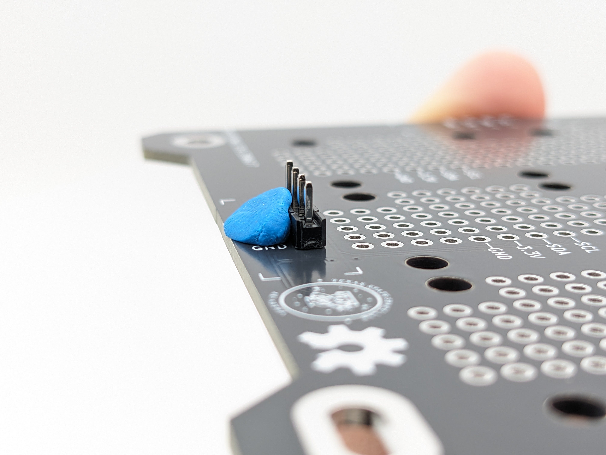
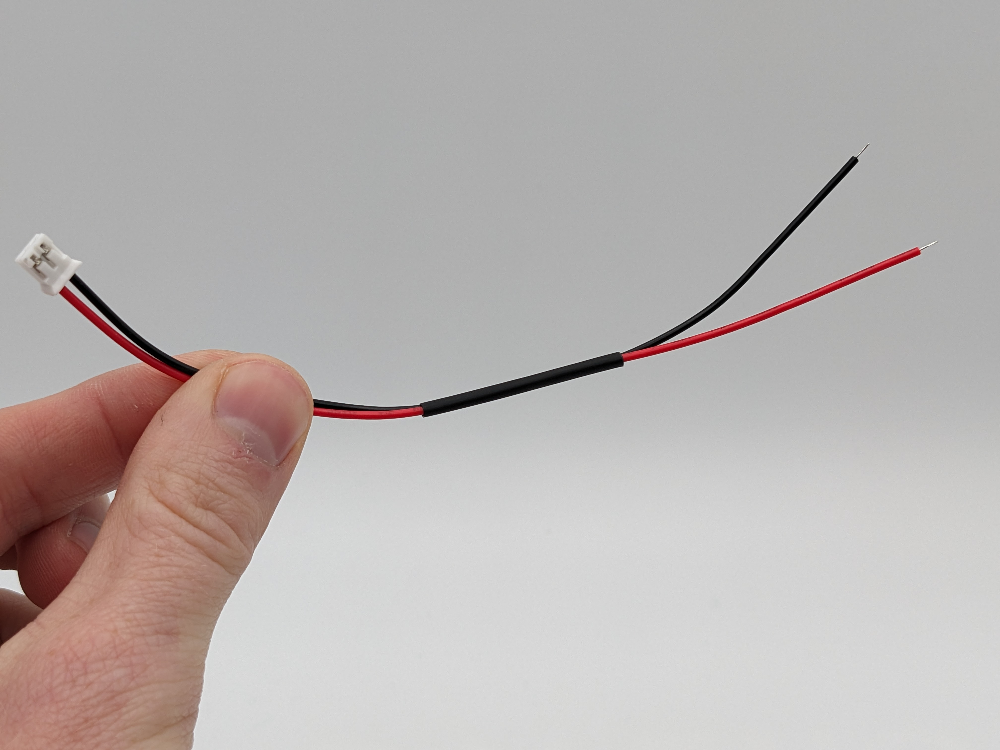

Once your (mostly) assembled boards have arrived from JLCPCB ([Step 1](https://www.mosaicsat.org/getting_mosaic/self_assemble/fabricate_boards/)), and you've received all necessary components from MOSAIC's BOM ([Step 2](https://www.mosaicsat.org/getting_mosaic/self_assemble/purchase_components/)), you're then ready to finish the assembly of these boards.

There are a few components on MOSAIC's Main Board and ProtoBoard that JLCPCB doesn't assemble in step 1 of this guide. You will also need to prepare the solar cells for connecting to the Power Board. Follow the steps below to assemble the two boards and solar cells.

-   :fontawesome-solid-screwdriver-wrench:{ .lg .middle } __Tools Needed__

    ---

    - Soldering iron
    - Solder wire
    - (Optional) [Blu-tack putty](https://en.wikipedia.org/wiki/Blu_Tack)
    - (Recommended) Solder Paste (T5 recommended)
    - (Recommended) Soldering heat gun

-   :fontawesome-solid-stopwatch:{ .lg .middle } __Time to complete__

    ---

    ~ 120 min.

-   :fontawesome-solid-money-bills:{ .lg .middle } __Estimated Cost__

    ---

    ~ $0*

    *Cost is assuming you already own the needed tools listed above

-   :fontawesome-solid-gauge:{ .lg .middle } __Difficulty__

    ---

    Moderate/Difficult

---

## I. Finish Main Board assembly

The following components need to be assembled to MOSAIC's Main Board. These components were purchased from MOSAIC's BOM in [Step 2](https://www.mosaicsat.org/getting_mosaic/self_assemble/purchase_components/) of the self-assembly guide.

| Component Name | Board Location                                                                                  | Quantity | Description            |
| :----------- | :------------------------------------------------------------------------------------------- | :-------------: | :--------------------- |
| M2.5X0.45 solderable standoff | Front { width="300" height="300" }  | 3 | Solderable standoffs for securing the Main Board processor and memory modules |
| 3.5mm stereo jack connector | Front { width="300" height="300" }  | 1 | Remove before flight (RBF) connector |
| M2.5X0.45 solderable standoff | Back { width="300" height="300" }  | 3 | Solderable standoffs for securing function boards to MOSAIC's Main Board |

It's recommended to assemble the M2.5X0.45 solderable standoffs using solder paste and a heat gun. However, if you don't have access to these, you can still assemble the standoffs using a soldering iron and solder wire. 

!!! info "Which step to follow"
    If you're using solder paste and a heat gun, follow step :octicons-arrow-right-24: **1** below. If you're using a soldering iron and solder wire, skip step 1 and follow step :octicons-arrow-right-24: **2** instead.

1. Assemble the M2.5X0.45 solderable standoffs to both the front and back of MOSAIC's Main Board using solder paste and a heat gun:

    1. Starting with the front of the board, add solder paste to one of the pads for the standoff (Figure 1).

        <figure markdown="span">
        
          <figcaption>**Figure 1**: Solder paste on standoff pad located on the front of MOSAIC's Main Board</figcaption>
        </figure>

        !!! warning "Make sure you're adding solder paste to the right side/pad"

            There are M2.5X0.45 solderable standoffs that need to be added to each side of the Main Board. You should only add solder paste to the pad on the side where the standoff will be placed. Refer to the images in the table above to determine which pads on each side require solder paste on top. (Only add solder paste where it's highlighted in red.)

    2. Place the standoff on the pad so that it sticks up on the side of the board it's intended for. (Figure 2) Ensure the standoff is as centered as possible within the hole of the pad.

        <figure markdown="span">
        
          <figcaption>**Figure 2**: Solderable standoff placed in pad with solder paste underneath</figcaption>
        </figure>

    3. Using a heat gun, apply heat to the solder paste surrounding the base of the standoff until it flows into the hole. You should see little to no solder paste left at the base of the standoff. (Figure 3)

        <figure markdown="span">
        
          <figcaption>**Figure 3**: Standoff after using heat gun on the solder paste. Notice that the paste has "flowed" into the pad and there is little left to see.</figcaption>
        </figure>
    
    4. Repeat steps a - c for all standoffs on each side of the Main Board. 

2. (**Skip this step if you completed step 1 above**) Assemble the M2.5X0.45 solderable standoffs to both the front and back of MOSAIC's Main Board using a soldering iron and solder wire:

    1. Starting with the front of the board, place one of the M2.5X0.45 solderable standoffs in one of the front pads so that it sticks up on the side of the board it's intended for. (Figure 4).

        <figure markdown="span">
        
          <figcaption>**Figure 4**: Standoff placed in one of the Main Board's back mounting pads</figcaption>
        </figure>

        !!! warning "Make sure your standoff is in the correct orientation"

            There are M2.5X0.45 solderable standoffs that need to be added to each side of the Main Board. When placing a standoff on a pad to be soldered, it should be sticking up on the side intended for it. Reference the images in the table above. Where it's highlighted red in these images is where the standoff should be sticking out of the board. 

    2. Using a soldering iron and solder wire, apply the solder to the pad and the base of the standoff. (Figure 5) You should apply solder around the entire base of the standoff. Apply solder until the standoff is well secured to the board. 

        <figure markdown="span">
        
          <figcaption>**Figure 5**: Soldering a standoff to the back of MOSAIC's Main Board using a soldering iron and solder wire</figcaption>
        </figure>

        ??? tip "Tip: Keping your standoff centered"

            To keep the standoff centered on its pad, you can try applying Blu-Tak to one side of the standoff to keep it still (see image below). Once applied, solder the opposite end of the standoff. Then, remove the Blu-Tak and complete soldering the standoff around its base.

            

    3. Repeat steps a - b for all standoffs on each side of the Main Board. 

3. Next, we will assemble the 3.5mm stereo jack connector to the front of the board using a soldering iron and solder wire:

    1. Place the connector on the front of the Main Board by feeding the pins of the connector through the holes to the back. (Figure 6)

        <figure markdown="span">
        
          <figcaption>**Figure 6**: 3.5mm audio jack connector placed on the front of MOSAIC's Main Board with its pins sticking through to the back of the board</figcaption>
        </figure>

    2. Solder each pin of the connector to the pads on the back of the Main Board.

        ??? tip "Tip: Keeping your audio jack still"

            To keep the connector in place on the board while soldering, apply a small amount of Blu-Tak to the edge of the connector on the front side of the Main Board (see image below).

            

Congratulations, you now have a fully assembled MOSAIC Main Board!

---

## II. Finish ProtoBoard assembly

The following components need to be assembled to MOSAIC's ProtoBoard. These components were purchased from MOSAIC's BOM in [Step 2](https://www.mosaicsat.org/getting_mosaic/self_assemble/purchase_components/) of the self-assembly guide.

| Component Name | Board Location                                                                                  | Quantity | Description            |
| :----------- | :------------------------------------------------------------------------------------------- | :-------------: | :--------------------- |
| SparkFun Qwiic Adapters | Front { width="300" height="300" }  | 3 | Breakout boards for connecting sensors on the ProtoBoard to the Main Board |
| 2mm pitch pin headers | Front { width="300" height="300" }  | 3 | pin headers for connecting the SparkFun Qwiic adapters to the ProtoBoard |

1. Solder the header pins to the ProtoBoard:

    1. Clip (or snap) your rows of pin headers so you have three sets of 4-pin rows. (Figure 7)

        <figure markdown="span">
        
          <figcaption>**Figure 7**: 4-pin headers needed for MOSAIC's ProtoBoard</figcaption>
        </figure>

    2. Feed the longer pin side of one of these 4-pin rows into the ProtoBoard in one of the areas highlighted red in the table above. The black plastic part of the header pin row should be positioned at the front of the ProtoBoard. (Figure 8)

        <figure markdown="span">
        
          <figcaption>**Figure 8**: 4-pin header placed on the fron of MOSAIC's ProtoBoard</figcaption>
        </figure>

    3. Solder the pins sticking through to the back of the ProtoBoard. (Figure 9)

        <figure markdown="span">
        
          <figcaption>**Figure 9**: 4-pin header pins soldered on the back of MOSAIC's ProtoBoard</figcaption>
        </figure>

        ??? tip "Tip: Keeping your header pins still"

            To help keep the header pin row in place (and perfectly vertical) while soldering, you can apply Blu-Tak to the side of the header pin row like in the image below.

             

    4. Repeat steps b - c for the other 4-pin header rows, placing them in the other areas highlighted red in the table above. 

2. Solder the Qwiic adapters to the header pins: 

    1. Place one of the SparkFun Qwiic Adapters on one of the 4-pin header rows. (Figure 10)

        <figure markdown="span">
        
          <figcaption>**Figure 10**: Qwiic adapter placed on 4-pin header</figcaption>
        </figure>

        !!! warning

            There is only one way the adapters should be placed on the header pins. Ensure that the pin labels on the adapter match the pin labels on the ProtoBoard. 

    2. Solder the header pins to the top of the Qwiic adapter. (Figure 11)

        <figure markdown="span">
        
          <figcaption>**Figure 11**: Qwiic adapter soldered on 4-pin header</figcaption>
        </figure>

    3. Repeat steps a - b for the other two 4-pin header rows and Qwiic adapters.

Congratulations, you now have a fully assembled MOSAIC ProtoBoard!

---

## III. Prepare the solar cells

Next, we will prepare the solar cells by attaching the male JST connectors purchased from MOSAIC's BOM in [Step 2](https://www.mosaicsat.org/getting_mosaic/self_assemble/purchase_components/) of the self-assembly guide. These JST connectors are what will plug into the mating female JST connectors on MOSAIC's Power Board. 

The pre-wired male JST connectors will be soldered onto the negative and positive pads on the back of the solar panels. 

!!! warning

    If you purchased the same JST connectors listed in MOSAIC's BOM, then the red wire will connect to the positive pad of the solar cell, and the black wire to the negative pad. However, not all pre-wired JST connectors are the same. 
    
    If you purchased your pre-wired JST connectors from a different source, then you should ensure that the red and black wires are not opposite of what's listed in this guide. Ensure that the correct wire goes to the correct pad by referencing the image below.

??? tip "Tip: JST cable management"

    Before you begin soldering, consider using heat shrink tubing around the two wires of the JST cable (see the image below). This can help with cable management inside your satellite, but it is not necessary.

    

1. Solder the exposed end of the *red* wire of your JST cable to the positive pad on the back of the solar cell.

2. Solder the exposed end of the *black* wire of your JST cable to the negative pad on the back of the solar cell.

3. Repeat steps 1 and 2 above for 11 more solar cells.

Congratulations, you now have 12 prepared solar cells for your satellite! 

---

[:octicons-arrow-left-24: Back to step 2](https://www.mosaicsat.org/getting_mosaic/self_assemble/purchase_components/){ .md-button } [Next to step 4 :octicons-arrow-right-24:](https://www.mosaicsat.org/getting_mosaic/self_assemble/print_frame/){ .md-button }