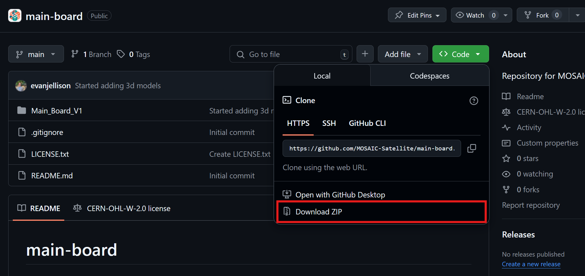
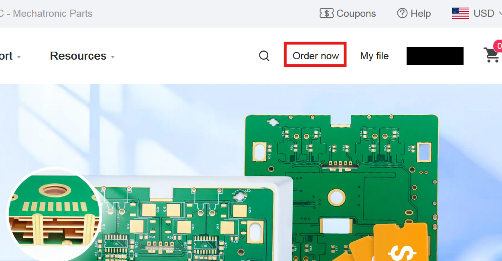
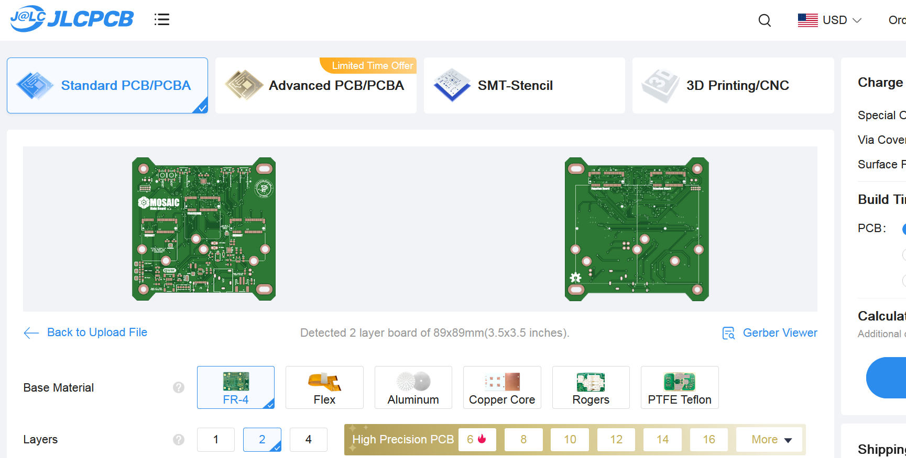
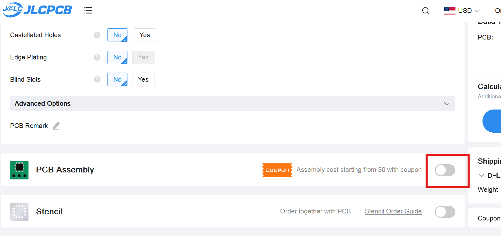
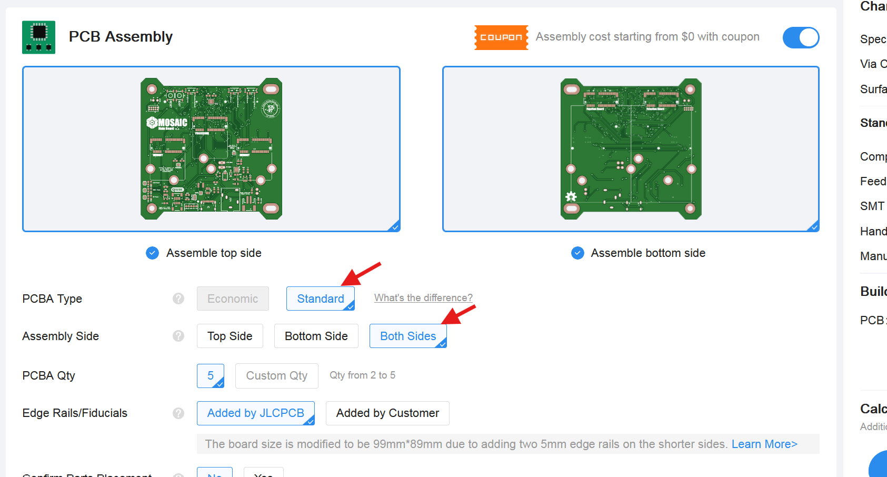
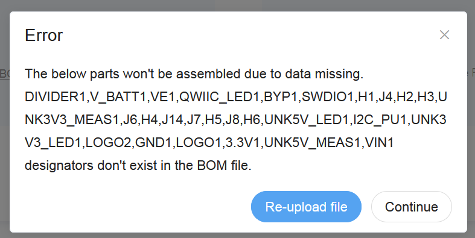
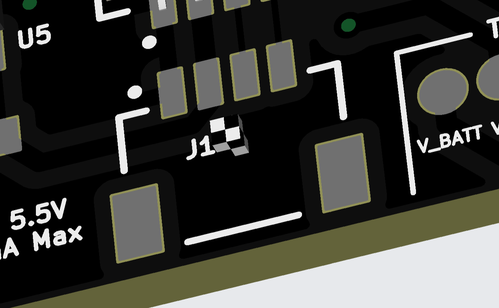

There are three printed circuit boards (PCBs) that make up the internals of the MOSAIC. You can learn more about these boards in the [MOSAIC elements](https://www.mosaicsat.org/overview/mosaic_elements/) page of the overview section of this site. 

This first step guides you through setting up a PCB manufacturer to fabricate and assemble all three MOSAIC boards. 

-   :fontawesome-solid-screwdriver-wrench:{ .lg .middle } __Tools Needed__

    ---

    - Computer (it's not recommended to do this step on a phone or tablet)

-   :fontawesome-solid-stopwatch:{ .lg .middle } __Time to complete__

    ---

    ~ 30 min.

-   :fontawesome-solid-money-bills:{ .lg .middle } __Estimated Cost__

    ---

    ~ $230*

    *Cost can vary due to different shipping locations and PCB manufacturer pricing for destination country.

-   :fontawesome-solid-gauge:{ .lg .middle } __Difficulty__

    ---

    Easy

---

### I. Getting the necessary files

All MOSAIC files are hosted on the MOSAIC [GitHub organization](https://github.com/MOSAIC-Satellite). Each of the three MOSAIC PCBs has its own GitHub repository. You will need to get files from each of these repositories. Follow the steps below to complete this task. 

1. Start with MOSAIC's Main Board and visit its [GitHub repository](https://github.com/MOSAIC-Satellite/main-board).
2. Click on the green `<> Code` button next to the "About" section of the repository, then click `Download ZIP` (Figure 1). This will download the entire repository in a ZIP folder.
    <figure markdown="span">
    
      <figcaption>Figure 1: Where to find the "Download ZIP" button (red box)</figcaption>
    </figure>
3. Unzip (extract) the folder to any location on your computer. 
4. Repeat steps 1 through 3 above for MOSAIC's [Power Board](https://github.com/MOSAIC-Satellite/power-board) and [ProtoBoard](https://github.com/MOSAIC-Satellite/protoboard).

---

### II. Getting set up with the PCB manufacturer

Now let's get things ready to have a PCB manufacturer fabricate and assemble the MOSAIC boards. 

??? note "What PCB manufacturer should I use?" 
    All MOSAIC boards are designed to be manufactured and assembled by [JLCPCB](https://jlcpcb.com/), a PCB manufacturer based in China. This includes all components (resistors, chips, etc.) that will be assembled onto the boards by JLCPCB, so you don't have to. 

    The following guide is for creating MOSAIC boards fabricated by JLCPCB, but you don't need to use them if you don't want to. Please note that if you choose to have your boards manufactured and assembled by a different company, you will need to source all the board components from an alternative supplier. 

    The bill of materials (BOM) for components used by each board can be found in the board's repository within the `production` folder.

1. Visit the [JLCPCB website](https://jlcpcb.com/)
2. Sign in or create an account on their website.

---

### III. Set up Main Board for fabrication and assembly

1. While logged in on JLCPCB's website, click the `Order now` button on the site's homepage (Figure 2).
    <figure markdown="span">
    
      <figcaption>Figure 2: Where to find the "Order now" button (red box)</figcaption>
    </figure>
2. Click on the `Add gerber files` button. This will open your computer's file explorer.

    ??? info "What are gerber files?"
        A Gerber file is a standard file format used in PCB manufacturing to represent the design data for each layer of the board. Essentially, it's a blueprint that tells the PCB manufacturer how to create the physical board, including copper traces, solder masks, and silkscreen layers.

3. Locate and open the `MOSAIC_Main_Board_1.0` zipped folder in the extracted Main Board repository folder from step I above, found within: `main-board-main\Main_Board_V1\production`. You should see a rendering of both sides of the Main Board once this file has finished uploading. (Figure 3)

    !!! warning "Don't unzip the `MOSAIC_Main_Board_1.0` folder"
        You should not unzip the `MOSAIC_Main_Board_1.0` found within `main-board-main\Main_Board_V1\production`. JLCPCB's website requires a zipped folder uploaded to their website containing the Main Board's gerber files.
    
    <figure markdown="span">
    
      <figcaption>Figure 3: Rendering of Main Board after uploading the gerber files</figcaption>
    </figure>

4. None of the options found under the board rendering need to be changed. However, you can customize your board by changing its `PCB Color` if you'd like. 

    ??? note "How many boards to order"
        The minimum quantity of boards you can order from JLCPCB is 5. This doesn't mean all five of these boards will be assembled with components by JLCPCB. You will have the option to choose how many are assembled in the following steps. The remaining of the 5 will be blank boards. (e.g., you set `PCB Qnt` to 5 and set `PCBA Qnt` (see below) to 2. This means you will receive 2 assembled boards and 3 blank boards).

5. At the bottom of the page, click on the slider for the `PCB Assembly` option (Figure 4).
    <figure markdown="span">
    
      <figcaption>Figure 4: Turn on the option for PCB assembly (red box)</figcaption>
    </figure>
6. Under the `PCB Assembly` option, make sure to set the `PCBA Type` to `Standard` and the `Assembly Side` to `Both Sides` (Figure 5). 
    <figure markdown="span">
    
      <figcaption>Figure 5: Set these options for PCB assembly</figcaption>
    </figure>
7. Choose the number of boards you would like to be assembled with components under the `PCBA Qnt` option. The minimum boards you can have assembled is 2.
8. Click the `Next` button on the right of the page. 
9. You will be directed to a top and bottom view of the board. Click the `Next` button to continue.
10. In the same `production` folder from step 3 above, there are two .csv files named `bom` and `positions`. Upload the `bom.csv` file where it says `Add BOM File` and upload the `positions.csv` file where it says `Add CPL File` (Figure 6). Then click the `Process BOM & CPL` button.
    <figure markdown="span">
    
      <figcaption>Figure 6: Where to upload the BOM and Positions files found in the main-board-main\Main_Board_V1\production folder</figcaption>
    </figure>

    !!! warning "Potential error"
        You may encounter the following error after clicking `Process BOM & CPL`. You can ignore this error and click `Continue` to continue. 
        
        <figure markdown="span">
         { width=60% height=60% }
        </figure> 

11. On the next page, ensure that all check boxes on the right side are selected (including those with an exclamation mark next to them), then click `Next`.
12. The next page will display a 2D/3D rendering of the board, showing all components that JLCPCB will assemble. The files you uploaded previously have the positions that all components are supposed to have on the board, but it's always a good idea to thoroughly inspect the board to ensure everything is in the correct location. If anything appears to be misaligned, click on the component, then use the tools and your keyboard's arrow keys to position it correctly. Click `Next` to continue.

    !!! warning "Missing models"
        Some board components may be missing 3D models. This means you will see a checkered box where the component model would be (see image below). This is ok and can be ignored. 

        <figure markdown="span">    
         { width=60% height=60% }
        </figure> 

13. Review the quote and order on the next page then click `Save To Cart`.

    !!! note "Don't purchase yet!"
        Don't purchase the boards yet! If you're planning to get a MOSAIC Power Board and ProtoBoard, wait to purchase the Main Board until the two others are in your cart—this way, you pay for shipping for all boards at once instead of separately. 

---

### IV. Set up Power Board for fabrication and assembly

The power board is set up with JLCPCB in the same way as the Main Board above. Follow the same steps for the Main Board, but substitute the files from the Power Board repository you downloaded. 

!!! note "Don't worry about the missing pieces"
    The Power Board has several components that will be assembled manually, rather than through JLCPCB. This means you won't see these components rendered on the board after uploading the bom.csv and positions.csv files. These components will be purchased and assembled, with subsequent steps outlined in this guide.

---

### V. Set up ProtoBoard for fabrication

The ProtoBoard will not have any components on it to be assembled by JLCPCB. For the ProtoBoard, you only need to follow steps 1-4 of the Main Board, using the files specific to the ProtoBoard. Once you complete step 4, click `Save To Cart` on the right side. 

---

### VI. Order the Boards!

Now that you have the boards you need in your cart, it's time to order them! 

Click on the cart icon at the top right of the screen. Make sure to select all the boards with the check boxes on the left then checkout! 