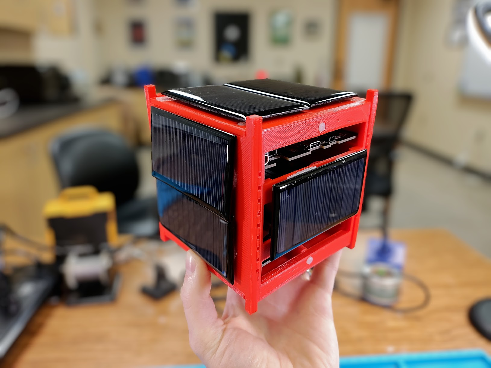

# Welcome to MOSAIC

MOSAIC, or *Modular Orbital Satellite for Advanced Innovation and Curriculum*, is an open-source, modular satellite platform designed to advance space technology education and accelerate satellite mission design.

Figure 1: A fully assembled MOSAIC 1U CubeSat

## What is MOSAIC?

MOSAIC is a demonstrator satellite, or “mocksat,” that uses commercial off-the-shelf (COTS) components and a modular hardware ecosystem to make satellite technology accessible, affordable, and adaptable for educational institutions and research teams.

A mocksat has all the functionalities of a space satellite without the high cost and other challenges associated with “space-ready” satellites. Instead of going to space, this mocksat is intended to help teach satellite mission design or to be a prototyping platform for a satellite that will leave Earth’s atmosphere.

Figure 2: All three types of boards of the MOSAIC mocksat. From left to right: Power Board, Main Board, and ProtoBoard

With MOSAIC, you can build a satellite that meets your mission's needs. Everything on MOSAIC, from its processor to its sensors, can be customized through easily swappable modules. This customizability allows students and developers to learn about each part of a satellite and the importance of selecting the right component for their mission. 

## How to Use this Site

This site has what you need to learn more about, aquire your own, and use your own MOSAIC mocksat. This site is organized into the following five sections: 

- [Overview:](https://www.mosaicsat.org/overview/) Learn more about the design philosophy behind MOSAIC and how it was created to help learn satellite mission design and operations. 
- [Getting your own MOSAIC:](https://www.mosaicsat.org/getting_mosaic/) A chapter by chapter walkthrough of assembling your own MOSAIC mocksat.
- [Quick Start Guide:](https://www.mosaicsat.org/quick_start/) Already have your own MOSAIC? The *Quick Start Guide* will step you through how to use the mocksat.
- [Core Documentation:](https://www.mosaicsat.org/core_documentation/) Documentation, resources, and troubleshooting for all peices of the MOSAIC mocksat.
- [Publications:](https://www.mosaicsat.org/publications/) Read the various publications that feature the MOSAIC mocksat and its use. 