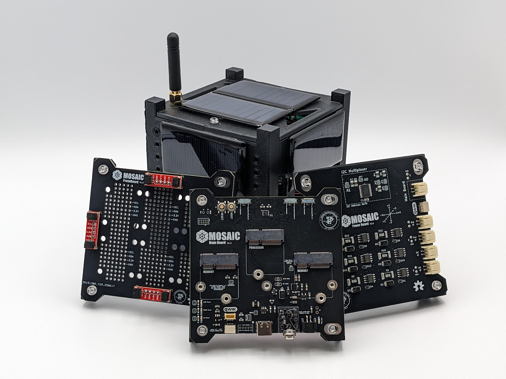
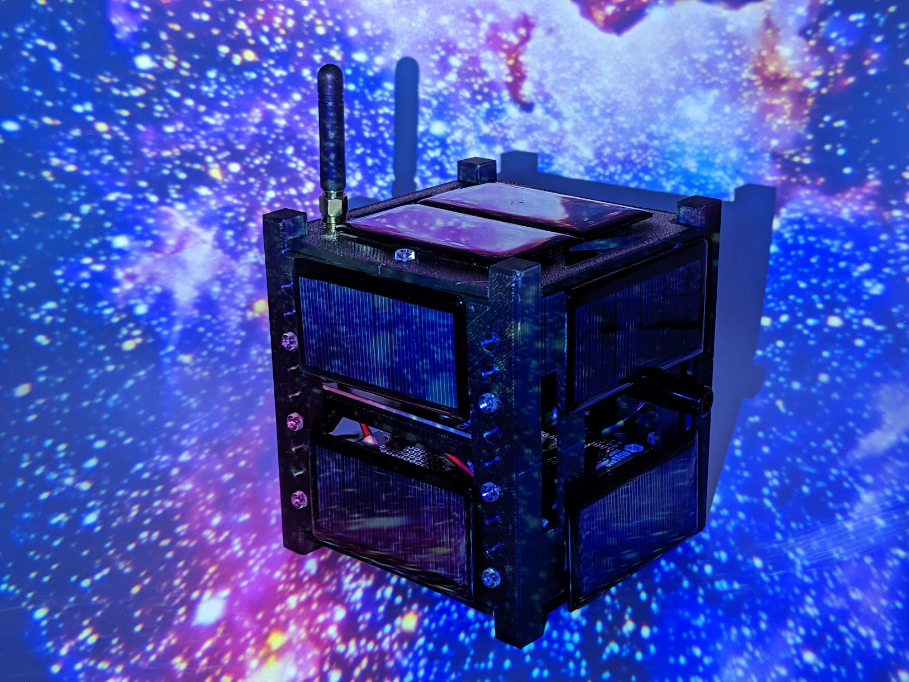

#  Welcome to MOSAIC

MOSAIC, or *Modular Orbital Satellite for Advanced Innovation and Curriculum*, is an open-source, modular satellite platform designed to advance space technology education and accelerate satellite mission design.

## What is MOSAIC?

MOSAIC is a demonstrator satellite, or “mocksat,” that uses commercial off-the-shelf (COTS) components and a modular hardware ecosystem to make satellite technology accessible, affordable, and adaptable for educational institutions and research teams.

As a mocksat, MOSAIC can be used as an educational tool to teach students about satellite mission design and hardware. The MOSAIC system can also serve as a prototyping platform for testing and building space mission hardware. MOSAIC's Main Board can also serve as a scientific payload control board and will be utilized in a CubeSat mission scheduled to launch in Q2 2026. 

With MOSAIC, you can build a satellite that meets your mission's needs. Everything on MOSAIC, from its processor to its sensors, can be customized through easily swappable modules. This customizability allows students and developers to learn about each part of a satellite and the importance of selecting the right component for their mission. 

## Features

| MOSAIC Features |
| :-------------: |
|Swappable processors and sensors |
| Low-cost and *reusable* design |
| Open-source hardware and software |
| Robust online documentation |
| Compatible with SparkFun® MicroMod |

## How to Use this Site

This site provides you with the resources you need to learn more about, acquire your own, and utilize your own MOSAIC mocksat. The site is organized into the following sections: 

- [Overview:](https://www.mosaicsat.org/overview/) Learn more about the design philosophy behind MOSAIC and its pieces.
- [Getting Your Own MOSAIC:](https://www.mosaicsat.org/getting_mosaic/) A chapter-by-chapter walkthrough of assembling your own MOSAIC mocksat.
- [Quick Start Guide:](https://www.mosaicsat.org/quick_start/) Already have your own MOSAIC? The *Quick Start Guide* will step you through how to use the mocksat.
- [Core Documentation:](https://www.mosaicsat.org/core_documentation/) Documentation, resources, and troubleshooting for all pieces of the MOSAIC mocksat.
- [Contact:](https://www.mosaicsat.org/contact/) Contact us about any questions or comments you have regarding MOSAIC.