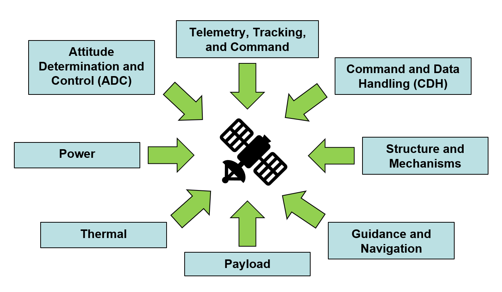
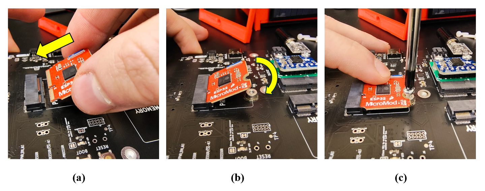

# Design Philosophy

Satellites are often built as a collection of parts called “subsystems” that each contribute to the overall functionality of the satellite. 

For example, the *power subsystem* comprises all parts of the satellite that control the input and output of its power usage. This includes its energy storage (batteries), solar panels to charge the batteries, and regulators to monitor the flow of power and protect the system from failures. Another example is the *Attitude Determination and Control (ADC) subsystem* which contains components to both determine the orientation of a satellite (its attitude) and to change that orientation if desired.

<figure markdown="span">
 { width=50%, height=50% }
  <figcaption>Common subsystems of a space satellite</figcaption>
</figure>

These subsystems are designed to support the spacecraft's mission. For example, sometimes, the mission requires precise pointing of the satellite at specific objects, such as what is required of space telescopes. This would require special attention to be paid to the ADC subsystem to ensure it can achieve the required pointing precision. 

The ADC subsystem also needs to work well with the other systems. For example, the satellite designer would need to consider the power subsystem and ensure that the satellite can supply enough power to the ADC to meet its needs without completely draining the batteries. Creating a satellite means developing each of its parts while maintaining a cohesive working relationship among these parts.

<figure markdown="span">
 { width=50%, height=50% }
  <figcaption>All three types of boards for the MOSAIC mocksat. From left to right: Power Board, Main Board, and ProtoBoard</figcaption>
</figure>

This piecemeal nature of satellites was the inspiration behind MOSAIC. This mocksat aims to simulate all the functions of a space satellite without the added complexity and high-cost components needed to make a “space-ready” satellite. Considerations were made in the creation of MOSAIC to simulate a real space satellite as closely as possible, including having the mocksat be comprised of a distinct collection of subsystems that each serve their own purpose.

The design of MOSAIC is centered around an ecosystem of modular components. Most of these components connect using the [M.2 form factor](https://en.wikipedia.org/wiki/M.2). The M.2 form factor focuses on card-like computer modules that connect to a central computer board, allowing for quick changing of satellite parts. This design approach was inspired by the ["MicroMod"](https://www.sparkfun.com/micromod) interface ecosystem from SparkFun Electronics. In fact, all modules in the MicroMod lineup are entirely compatible with the MOSAIC ecosystem. 

<figure markdown="span">
 
  <figcaption>Example of (a) inserting an M.2 module into MOSAIC’s Main Board and (b and c) securing the module to the board</figcaption>
</figure>

The primary objectives of MOSAIC are to increase access to space by reducing the sharp learning curve for satellite design and operations and to accelerate satellite mission design. To ensure MOSAIC meets these goals, three design philosophies were outlined to guide the development of the tool. Each of MOSAIC’s pieces is intended to align with one or more of these philosophies. These are:

??? note "1. Using MOSAIC should not increase the complexity of satellite mission design"
    Given that satellite design and operations are already complex endeavors, it wouldn’t make sense for a tool designed to alleviate these learning hurdles to add more complexity instead. Therefore, considerations were made to ensure that the design did not overshadow the function. This philosophy is essentially the same as the popular motto KISS: “Keep it simple, stupid.” 

??? note "2. MOSAIC should be customizable and adaptable"
    Mission needs can differ wildly from one to another. One satellite designed to take pictures of Earth can be drastically different from one built for dish TV. In other words, there are a multitude of architectural arrangements for satellites, and MOSAIC should reflect that. While there are still learning opportunities in building a mocksat of singular design, there are far more opportunities in allowing users to create their own satellite. Customizability and adaptability facilitate learning how to build a satellite system tailored to the mission's specific needs. This design philosophy also directly benefits the acceleration of satellite mission design for the same reasons. 

??? note "3. MOSAIC should be accessible"
    Finally, accessibility. If hurdles are preventing potential adopters of MOSAIC from using the tool, then that defeats the comparative goal of increasing access to space. The financial cost of MOSAIC should remain low; the parts needed for its use should not be difficult to obtain, and the intricacies of its design and use should not be obscured by copyright laws and inaccessible documentation.