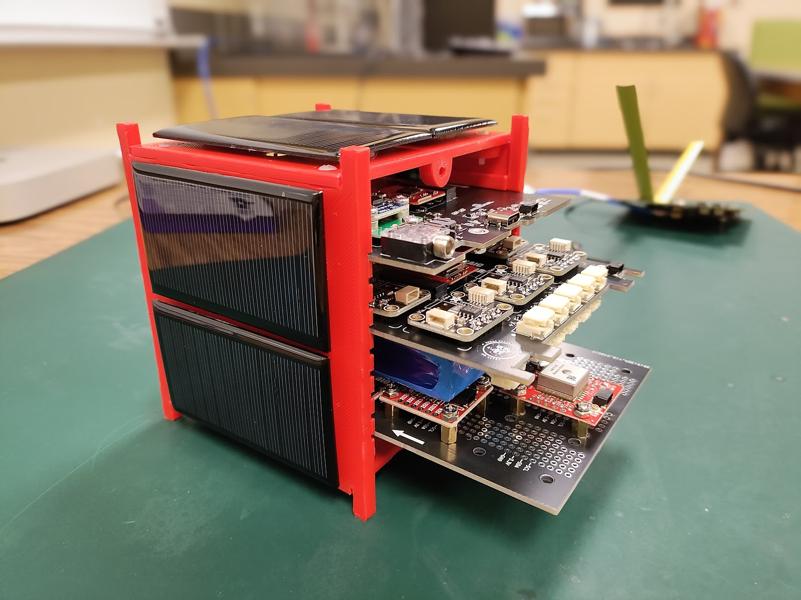

<figure markdown="span">
  { width=50%, height=50% }
  <figcaption>Open MOSAIC mocksat</figcaption>
</figure>

MOSAIC, or “Modular Orbital Satellite for Advanced Innovation and Curriculum,” is a type of demonstrator satellite, commonly referred to as a “mocksat” for short, which aims to help minimize the hurdles of satellite design and operation and highlight the potential for satellite projects to be a valuable tool for education.

??? question "What is a mocksat?"
    A mock satellite, or "mocksat," is a full-scale replica of a satellite, often used for testing and training purposes. These mock-ups are crucial for various stages of satellite development, from integration and fit checks, and are also used as tools for learning satellite design and operations. Mocksats attempt to simulate as closely as possible a real satellite without the high costs associated with space-ready satellites.

## Objectives

The primary objectives of MOSAIC are to:

1. Increase access to space
2. Accelerate satellite mission design.

This project was designed to fulfill these objectives in several ways:

??? note "Modular Components"
    MOSAIC features a modular ecosystem of various components and sensors designed to make learning about satellite systems less daunting for those new to the concept. The user can easily interchange the main components of a satellite, like its radio, sensors, and onboard computer (OBC). By breaking down the satellite into these base components, each of which can be replaced by a different component, we allow students to try different system designs and learn these systems one part at a time. The satellite is essentially composed of a foundation and building blocks that can be added when ready.

??? note "Low-Cost Usage"
    MOSAIC's use of Commercial Off-the-Shelf (COTS) parts significantly lowers the barrier to entry for satellite development. The availability and affordability of these components make it feasible for smaller organizations and educational institutions to participate in satellite mission design projects, which were previously reserved for large, well-funded entities.

    MOSAIC can also be customized without permanently altering its hardware. This allows for the mocksat to be reused indefinitely, saving costs in the long run.

??? note "Open-Source Design"
    Oftentimes, hardware is designed by private institutions who have a financial interest in keeping their designs from being freely available to the public. This prevents people or competitors from replicating or altering these designs.

    Users of MOSAIC will not encounter this barrier when adopting the mocksat for use. Instead, MOSAIC is an example of open-source hardware. All design files, schematics, and documentation for MOSAIC are freely available online.

    !!! tip "Make Sure to Check Out the GitHub!"

        All of MOSAIC's design files and software are available on [GitHub](https://github.com/MOSAIC-Satellite) under open-source licenses. We welcome interested users and contributors to take a look and get in touch! 

## Uses

MOSAIC can be used as a prototyping framework to help build a satellite system for a space mission or as an educational tool to teach satellite systems engineering. 

As a prototyping framework, the modular nature of MOSAIC enables satellite developers to experiment with different arrangements of components, such as processors and sensors, to create a spacecraft that meets the needs of their mission. Most components are easily swappable without permanently altering the mocksat, optimizing development time.

As an educational tool, MOSAIC can be used to teach students how to design and operate a satellite that meets the specific needs of a mission. Furthermore, using this mocksat can introduce students to important hard skills, such as coding, soldering, circuit design, and more. 