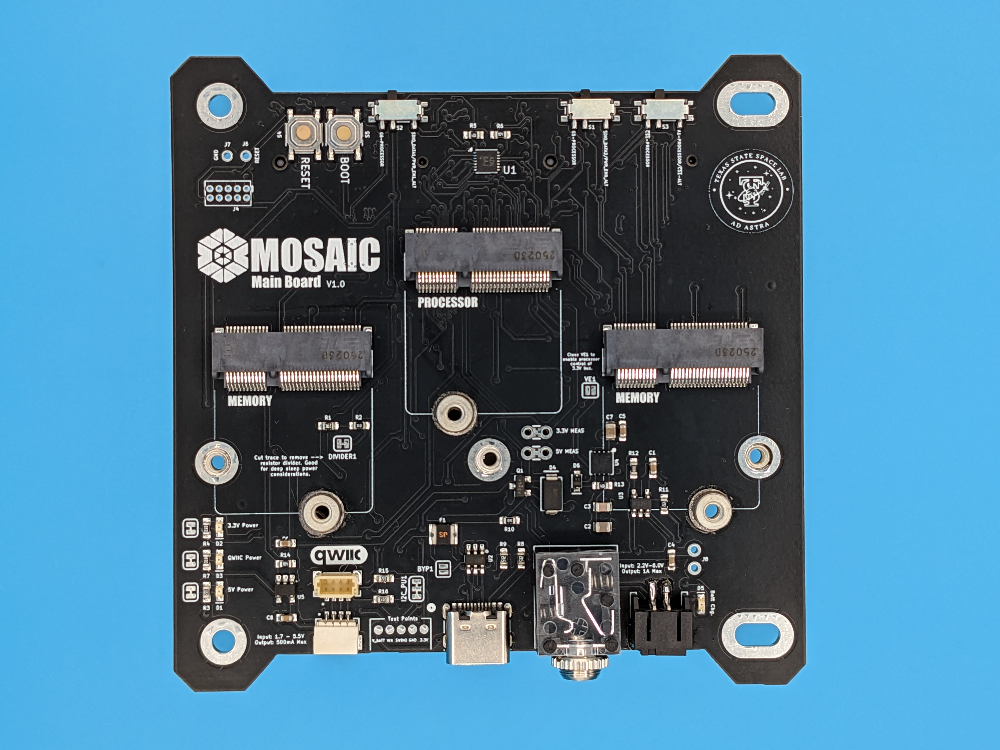
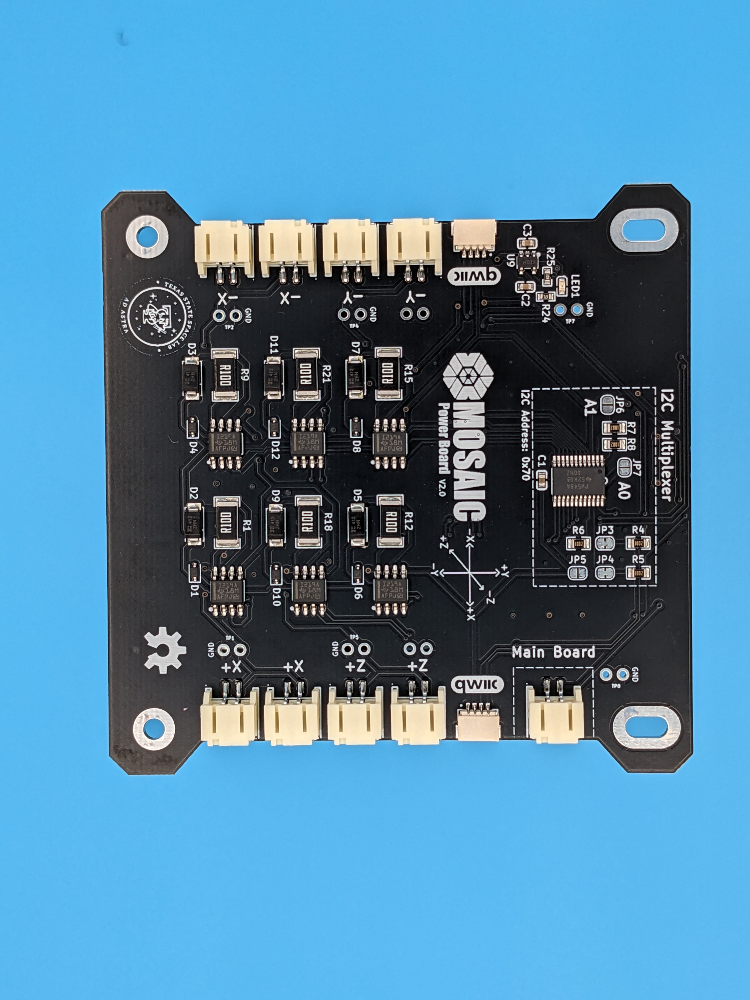

<figure markdown="span">
 { width=50%, height=50% }
  <figcaption>All three types of boards for the MOSAIC mocksat. From left to right: ProtoBoard, Main Board, and Power Board</figcaption>
</figure>

MOSAIC consists of three main circuit boards and a frame. 

-   :fontawesome-solid-computer:{ .lg .middle } __Main Board__

    ---

    At the core of the mocksat is its “Main Board.” This circuit board is essentially the command and Data Handling (CDH) subsystem of the mocksat. There is a slot on the board to insert the user’s choice in the processor for commanding the satellite and its various parts. Two other slots are also available to add expandable memory, giving the user more choice in the data handling of the system. Beyond the usual functions of a CDH subsystem, the Main Board also features two slots for adding function boards, such as sensors or transceivers.
    
    

    [:octicons-arrow-right-24: Core Documentation Link](https://www.mosaicsat.org/core_documentation/hardware/main_board/)  
    [:octicons-arrow-right-24: GitHub Repo Link](https://github.com/MOSAIC-Satellite/main-board)

-   :material-battery-charging-100:{ .lg .middle } __Power Board__

    ---

    MOSAIC’s “Power Board” houses the satellite's battery and monitors power flow. There are inputs to connect external solar panels for charging the system’s batteries and several DC sensors. The satellite operator can utilize these sensors to monitor both the battery charge level and the power generated by the solar panels. Control of this board can be done directly from MOSAIC’s Main Board through the Qwiic connection system that utilizes the I^2^C protocol.

    
    

    [:octicons-arrow-right-24: Core Documentation Link](https://www.mosaicsat.org/core_documentation/hardware/power_board/)  
    [:octicons-arrow-right-24: GitHub Repo Link](https://github.com/MOSAIC-Satellite/power-board)

-   :material-clock-fast:{ .lg .middle } __ProtoBoard__

    ---

    MOSAIC's "ProtoBoard" is designed to give MOSAIC users the freedom to create their own subsystems for their satellite. Users can create a subsystem comprising of components they choose, adding to the customizability of the mocksat.

    
    

    [:octicons-arrow-right-24: Core Documentation Link](https://www.mosaicsat.org/core_documentation/hardware/protoboard/)  
    [:octicons-arrow-right-24: GitHub Repo Link](https://github.com/MOSAIC-Satellite/protoboard)

-   :material-cube-unfolded:{ .lg .middle } __CubeSat Frame__

    ---

    To further simulate a space satellite, the structure of MOSAIC was chosen to adhere to the [“CubeSat” standard](https://www.cubesat.org/cubesatinfo). This is a popular standardized satellite form factor among both educators and industry alike. In the case of MOSAIC, the 1U satellite structure is 3D printable, making it relatively easy to acquire and produce.

    
    

    [:octicons-arrow-right-24: Core Documentation Link](https://www.mosaicsat.org/core_documentation/hardware/structure/)  
    [:octicons-arrow-right-24: GitHub Repo Link](https://github.com/MOSAIC-Satellite/frame)

