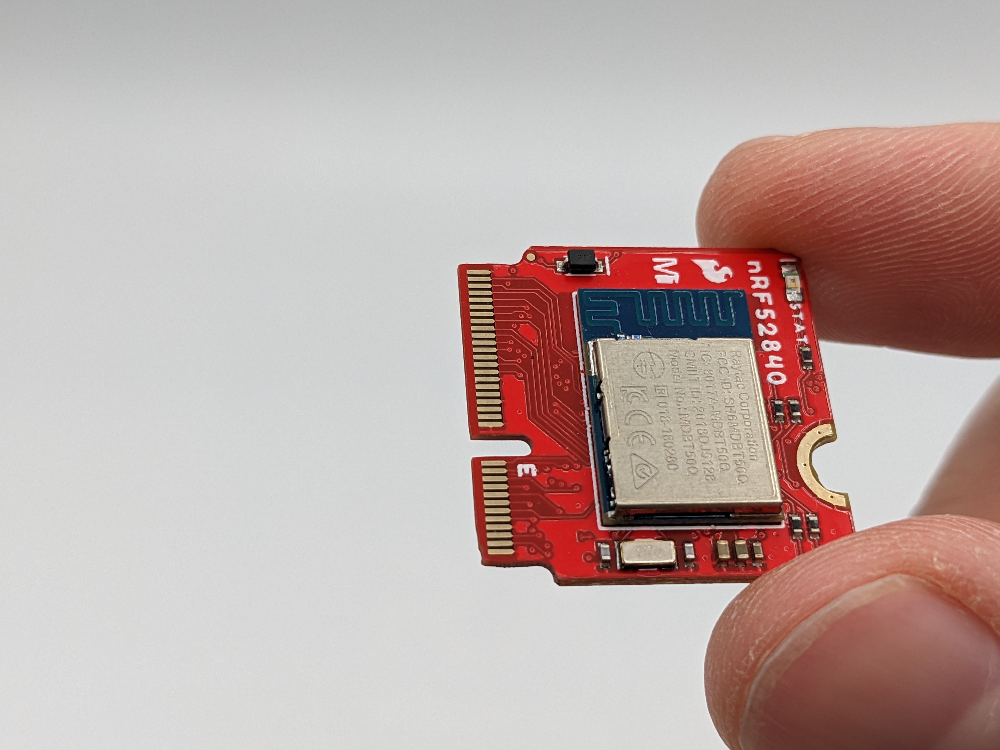
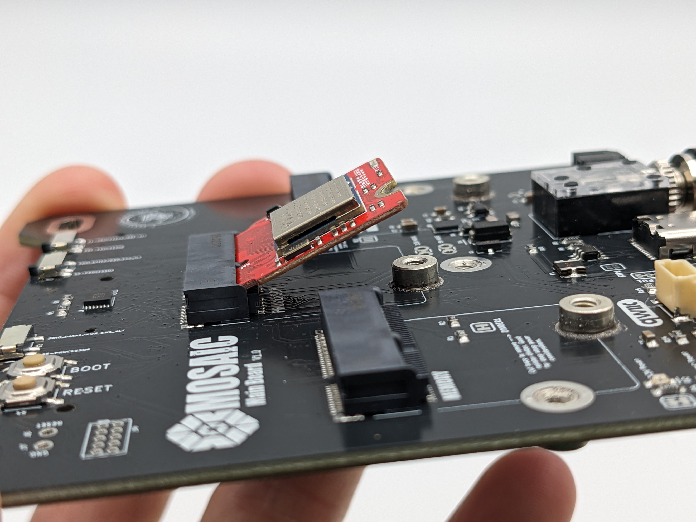
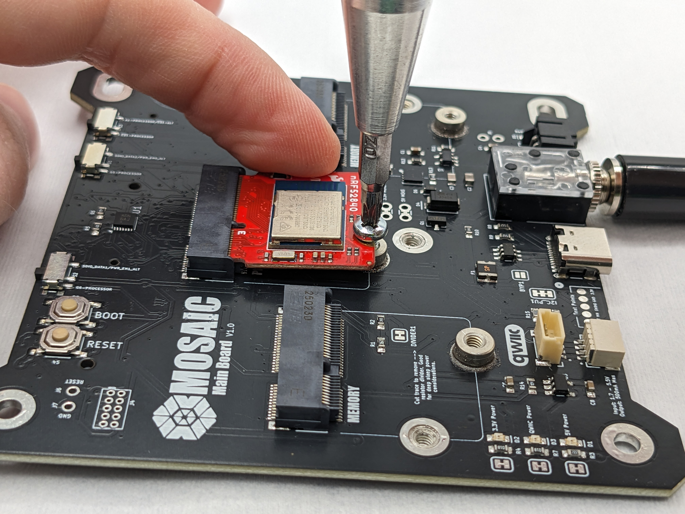
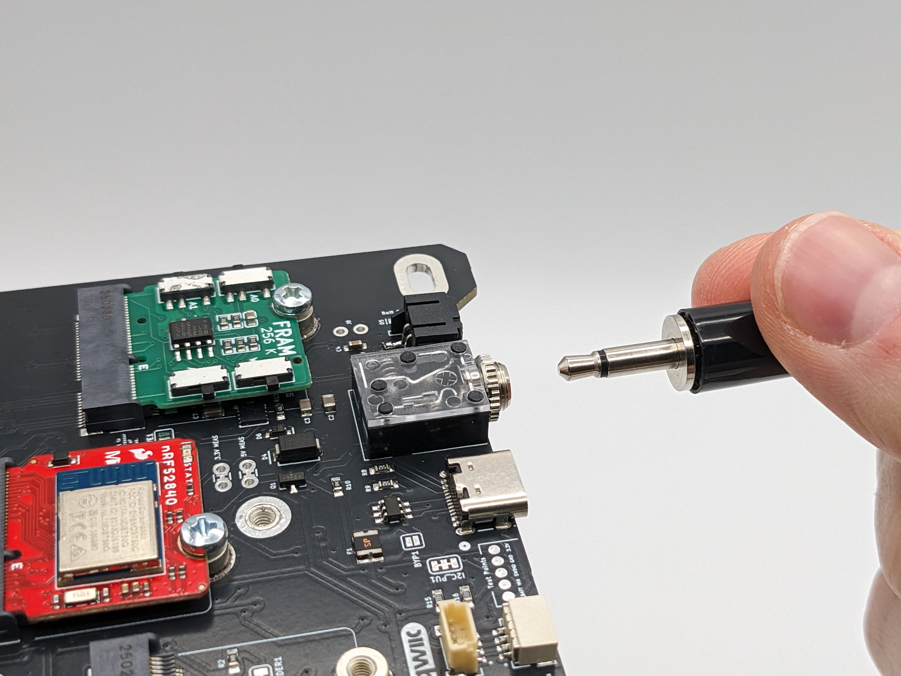
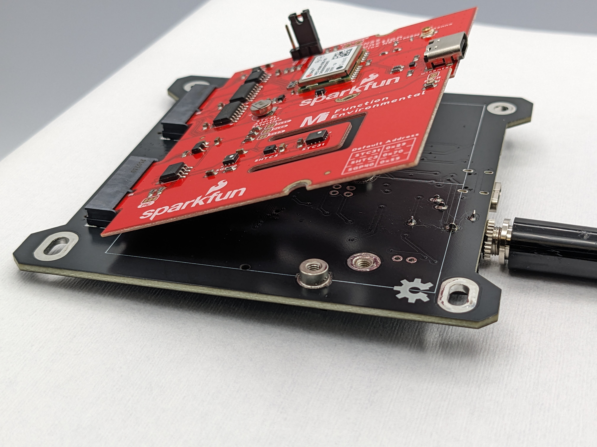
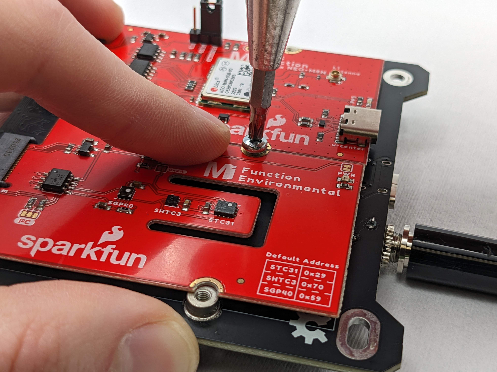
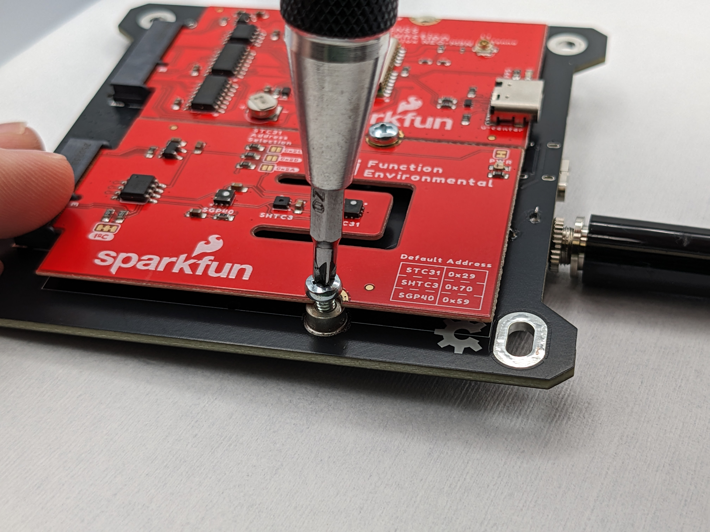
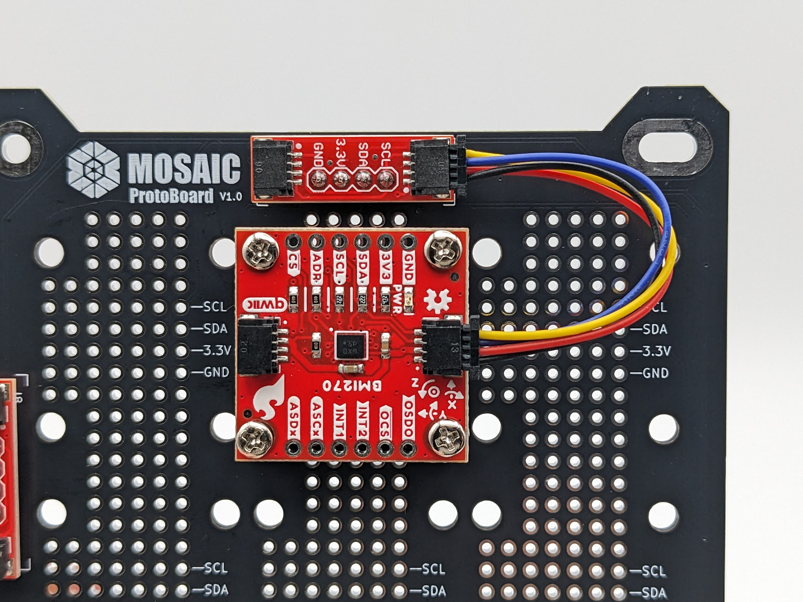

-   :fontawesome-solid-screwdriver-wrench:{ .lg .middle } __Tools Needed__

    ---

    - Phillips head screwdriver for M2.5 and M3 screws

-   :fontawesome-solid-stopwatch:{ .lg .middle } __Time to complete__

    ---

    ~ 15 min.

-   :fontawesome-solid-gauge:{ .lg .middle } __Difficulty__

    ---

    Easy

---

### I. Connect your processor, memory module(s), and RBF pin

1. Your processor board connects to MOSAIC's Main board using the M.2 form factor. 

    Insert the key of your processor board (Figure 1) into the M.2 slot on the Main Board labeled "Processor" at an angle of about 30°. (Figure 2)

    <figure markdown="span">
     { width=90%, height=90% }
      <figcaption>**Figure 1**: The "key" of a processor board is the edge of the board with the exposed pins (left side of the board in this figure). Notice the notch on this side of the board. This notch ensures that there is only one orientation for inserting the board into the Main Board.</figcaption>
    </figure>

    <figure markdown="span">
     { width=90%, height=90% }
      <figcaption>**Figure 2**: Processor board inserted into its mating slot on the Main Board at an angle.</figcaption>
    </figure>

- Once the board is in the socket, gently push and hold the processor board down and tighten the screw with a Phillips head. (Figure 3)

    <figure markdown="span">
     { width=90%, height=90% }
      <figcaption>**Figure 3**: Securing a processor board to MOSAIC's Main Board.</figcaption>
    </figure>

- Connect your memory module to one of the slots labeled "Memory" and secure it to the board using the same process as the processor board above.

- Insert the remove before flight (RBF) pin (the 3.5 mm audio plug keychain) into the 3.5 mm audio jack on the top of the Main Board. (Figure 4)

    <figure markdown="span">
     { width=90%, height=90% }
      <figcaption>**Figure 4**: Inserting the remove before flight (RBF) pin into MOSAIC's Main Board.</figcaption>
    </figure>

### II. Connect your function board(s)

If you're using any MicroMod-compatible [function boards](https://www.mosaicsat.org/core_documentation/hardware/main_board/function_boards/), insert them into the M.2 slots labeled "Function board" on the back of MOSAIC's Main Board. The process of adding these boards is similar to adding a processor above. 

1. Insert the key of your processor board into the M.2 slot on the Main Board labeled "Processor" at an angle of about 30°. If adding two function boards, insert them both now. (Figure 5)

    <figure markdown="span">
     { width=90%, height=90% }
      <figcaption>**Figure 5**: Inserting two function boards into their mating connectors on the back of MOSAIC's Main Board.</figcaption>
    </figure>

- Gently hold down the function board(s) and tighten the screw between the two function board slots with a Phillips head. (Figure 6)

    <figure markdown="span">
     { width=90%, height=90% }
      <figcaption>**Figure 6**: Securing two function boards to the back of MOSAIC's Main Board by driving a screw into the standoff between the boards.</figcaption>
    </figure>

- Tighten the screw(s) on the other side(s) of the function board(s) with a Phillips head. (Figure 7)

    <figure markdown="span">
     { width=90%, height=90% }
      <figcaption>**Figure 7**: Securing the outer edge of one of the function boards on the back of MOSAIC's Main Board.</figcaption>
    </figure>

### III. Connect sensors to MOSAIC's ProtoBoard

MOSAIC's [ProtoBoard](https://www.mosaicsat.org/core_documentation/hardware/protoboard/) serves as a carrier for the satellite's sensors. You can mount Qwiic/STEMMA QT compatible sensors to the board using the various mounting holes or solder the sensor directly to the board. 

Sensor data is sent to the satellite's processor using the I^2^C protocol through [Qwiic connectors](https://www.sparkfun.com/qwiic). 

1. Mount any number of your sensors to MOSAIC's ProtoBoard using M3 screws in the mounting holes (Figure 8) or solder them to the ProtoBoard using header pins.

    <figure markdown="span">
     { width=90%, height=90% }
      <figcaption>**Figure 8**: Qwiic sensor secured to MOSAIC's ProtoBoard using M3 screws on the top (a) and nuts on the bottom (b).</figcaption>
    </figure>

- Connect the sensors using a Qwiic cable inserted into any of the Qwiic ports on the ProtoBoard, (Figure 9) or connect the soldered-on header pins to the appropriate I^2^C through-hole pin. Be sure to leave one of the Qwiic ports on the ProtoBoard free. This port will connect your sensors to MOSAIC's Main Board (done in a future step).

    <figure markdown="span">
     { width=90%, height=90% }
      <figcaption>**Figure 9**: Connecting a sensor to MOSAIC's ProtoBoard using a Qwiic cable.</figcaption>
    </figure>